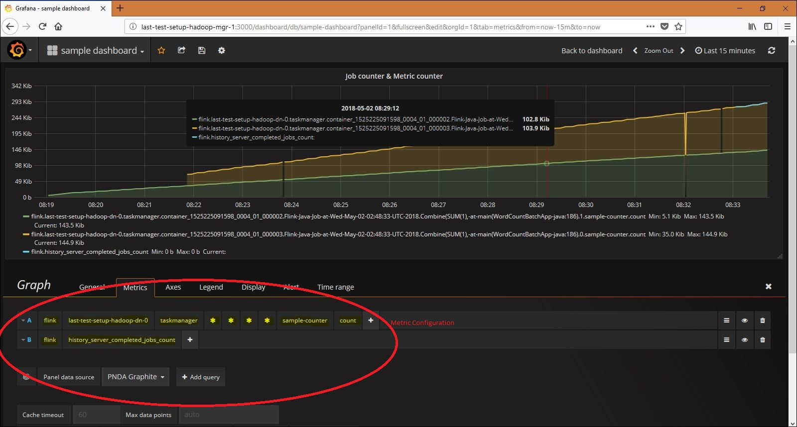
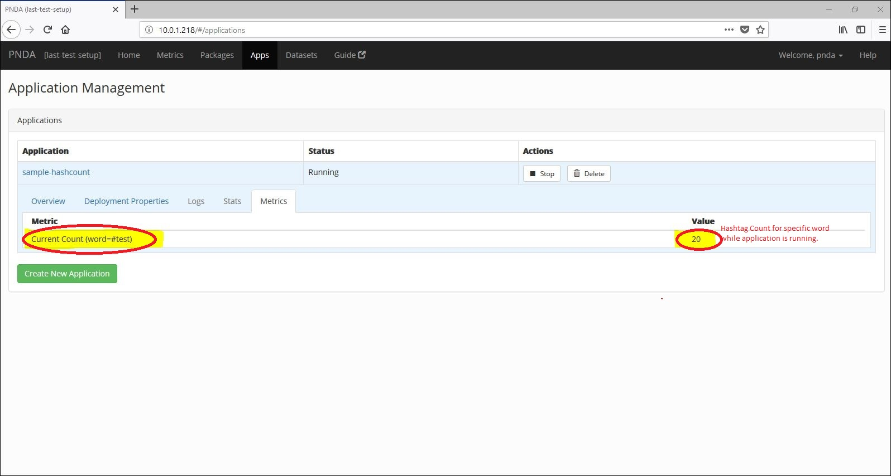

# Example Batch Processing Application: (Flink Streaming API) hashtag count from input file illustrating metrics, counters and accumulators.

The application serves as an example to illustrate the usage of below features in the flink application -
* [Flink Java API](https://ci.apache.org/projects/flink/flink-docs-release-1.4/dev/java8.html)
* [Flink Metrics](https://ci.apache.org/projects/flink/flink-docs-release-1.4/monitoring/metrics.html)
* [Flink Accumulators](https://ci.apache.org/projects/flink/flink-docs-release-1.4/dev/api_concepts.html#accumulators--counters)
* Metrics - Hashtag count (specific word count), can be viewed through PNDA metrics & Grafana.

## Overview

The example batch processing application shows an example of an application that can be deployed using the PNDA Deployment Manager. (See the [platform-deployment-manager](https://github.com/pndaproject/platform-deployment-manager) project for details.)

This example uses the Flink APIs. When PNDA is configured to use HDP/CDH cluster, Flink is deployed by default.

The application is a tar file containing binaries and configuration files required to perform some batch and stream processing.

Application consists of flink configuration arguments and application configuration argument. Application configuration includes file input ( --input ), application output ( --output ) and specific word ( --word ) options.

This example application reads data from the input file and performs basic counting analytics. In case, the input file is not provided it uses the default data sets packaged with the application. Input file can be provided using the --input option.

The results are printed into the console output of the flink driver process by default. To view these, navigate to the log file via the Yarn Resource Manager UI or use the PNDA log server. If required, output can be redirected to the user specific file using --output option.


# Flink Metrics

Along with total word count, specific word count is performed. This is meant to count the occurrence of specific word during the application execution and present it to the counter metrics ( using Flink custom metrics ) to monitor the application execution.
Therefore, the monitored data for specific word count is reported to the Graphite and same is available to the Grafana for application monitoring. Below is the sample chart -



The above graph is plotted by executing the flink application with 2 containers. The counter values from both the containers during application execution are reported to the Graphite.
The query formation is highlighted in the above image.


# Accumulators

Accumulators are simple constructs with an add operation and a final accumulated result, which is available after the job is complete. To view these, navigate to the log file via the Yarn Resource Manager UI or use the PNDA log server.

# PNDA logging metrics

The metrics can be observed in the metrics tab of the specific application under application management page.

The accumulators are configured in the application to accumulate the specific word count result. The same accumulator count is configured to send to the PNDA logging metrics and shows the instantaneous value at current moment.

Below is the image for the same -



As per the configured reporting interval for Graphite, the logging metric will be reported ( i.e. every one minute ).

## Requirements

* [Maven](https://maven.apache.org/docs/3.0.5/release-notes.html) 3.0.5
* [Java JDK](https://docs.oracle.com/javase/8/docs/technotes/guides/install/install_overview.html) 1.8

## Build
Edit the `batch-processing-app/pom.xml` file with the correct dependencies.

To build the example applications use:

````
mvn clean package
````

This command should be run at the root of the repository and will build the application package. It will create a package file `flink-batch-hashtagcount-metrics-java-example-app-{version}.tar.gz` in the `app-package/target` directory.

## Files in the package

- `application.properties`: config file used by the Flink Streaming java application.
- `properties.json`: contains default properties that may be overridden at application creation time.

## Deploying the package and creating an application

The PNDA console can be used to deploy the application package to a cluster and then to create an application instance. The console is available on port 80 on the edge node.

To make the package available for deployment it must be uploaded to a package repository. The default implementation is an OpenStack Swift container. The package may be uploaded via the PNDA repository manager which abstracts the container used, or by manually uploading the package to the container.

Once the application is running, the counter metric ( named sample-counter ) can be found in graphite and hence to the Grafana. Also, accumulator results can be observed in the logging metric while application is running and console output of the flink driver process after application ends.
