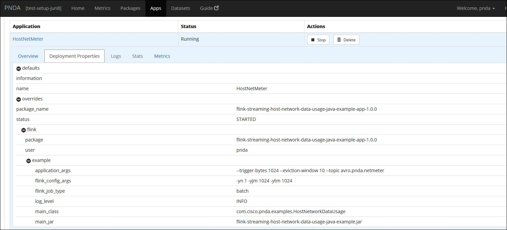
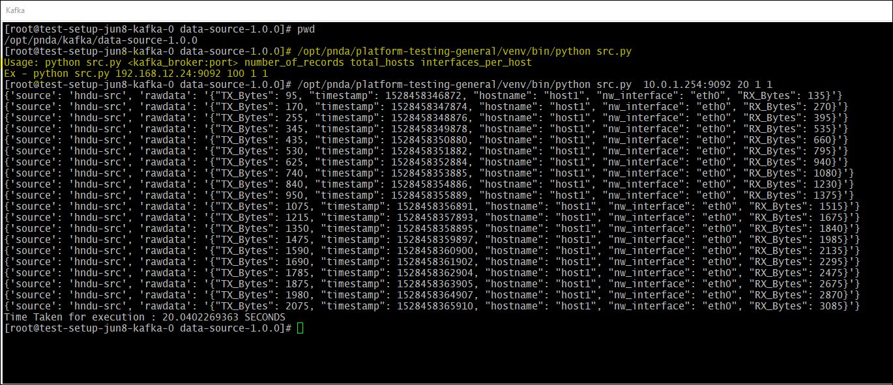
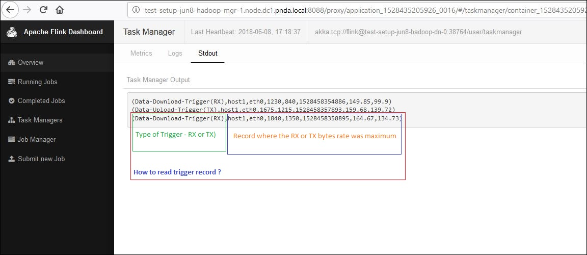

# Example Streaming Application: Host Network Data Usage illustrating Flink windows, triggers and event processing.

The streaming example application triggers the maximum download/upload speed of each network interface ( for every host ) every x bytes of data download/upload elapsed for the last y seconds.

The application demonstrates the flexible windowing, high throughput and low latency benefit of using flink data processing framework over its peers.   

The application serves as an example to illustrate the usage of below features in the flink application -
* [Flink Java API](https://ci.apache.org/projects/flink/flink-docs-release-1.4/dev/java8.html)
* [Flink Windows](https://ci.apache.org/projects/flink/flink-docs-release-1.4/dev/stream/operators/windows.html)
* [Flink Triggers](https://ci.apache.org/projects/flink/flink-docs-release-1.4/dev/stream/operators/windows.html#triggers)
* [Flink Connectors - AVRO Support](https://ci.apache.org/projects/flink/flink-docs-release-1.4/dev/batch/connectors.html)
* [Flink Kafka Connector](https://ci.apache.org/projects/flink/flink-docs-release-1.4/dev/connectors/kafka.html)


## Overview

The example stream processing application shows an example of an application that can be deployed using the PNDA Deployment Manager. (See the [platform-deployment-manager](https://github.com/pndaproject/platform-deployment-manager) project for details.)
This example uses the Flink APIs. When PNDA is configured to use HDP/CDH cluster, Flink is deployed by default.

The application is a tar file containing binaries and configuration files required to perform some batch and stream processing.

Here, the source fetches events from network interface cards on different hosts every second (configured to 1 second for better insight, depends on speed of data generation by data source) containing their host-name, interface-name, total bytes download (RX bytes), total bytes upload (TX bytes) and the time stamp. 

The streaming example application triggers the top download/upload speed (bytes/second) of each network interface every x bytes of data download/upload elapsed for the last y seconds.

**Example:** x = 1024 bytes , y = 10 seconds.
Here, Flink will trigger every time the network interface downloads/uploads 1024 bytes, And trigger will show the top download/upload speed of the network interface for last 10 seconds. 

Application consists of flink configuration arguments and application configuration arguments. 

Application configuration input parameters includes - 
- Topic ( name: **--topic**, default-value: **avro.pnda.netmeter** ) 
- Trigger Bytes ( name: **--trigger-bytes**, default-value: **1024** ) 
- Eviction Window Size ( name: **--eviction-window**, default-value: **10** )

Data source properties namely Zookeeper and Kafka brokers are used from the application properties and kafka topic as a user input for example application.

The Trigger Bytes and Eviction Window defines the data computation/processing logic.
 
The example application reads data from the specified kafka topic (data is expected in AVRO Format), de-serializes the data, parses network interface data from raw data and performs data processing for input infinite stream. 

Application configuration output parameters includes- 
- Data sink ( name: **--output** - No default value)
The results are printed into the console output of the flink driver process by default. To view these, navigate to the log file via the Yarn Resource Manager UI (RUNNING -> ApplicationMaster -> Task Managers -> stdout) or use the PNDA log server. 
If required, output can be redirected to the user specific file using --output option. This parameter is to be specified along with other application arguments.

The application expects avro encoded telemetry data set as samples listed below:
 ```
{'source': 'hndu-src', 'rawdata': '{"TX_Bytes": 2870, "timestamp": 1528357611936, "hostname": "host1", "nw_interface": "eth0", "RX_Bytes": 1120}', 'timestamp': 1528357611936L}
{'source': 'hndu-src', 'rawdata': '{"TX_Bytes": 2945, "timestamp": 1528357612940, "hostname": "host1", "nw_interface": "eth0", "RX_Bytes": 1140}', 'timestamp': 1528357612940L}
 ```

# Flink Windows

Windows are at the heart of processing infinite streams. Windows split the stream into "buckets" of finite size, over which we can apply computations.

In this example application, source fetches events from network interfaces containing their host-name, interface-name and their current data upload/download size(bytes) and the time stamp. 
The streaming example triggers the top upload/download speed of each network interface every x bytes elapsed for the last y seconds.

The Advantages of using Flink here is Flink streaming processes data streams as true streams, i.e. data elements are immediately "pipelined" through a streaming program as soon as they arrive. This allows performing flexible window operations on streams.

# Flink Connectors

Connectors provide code for interfacing with various third-party systems Like Apache Kafka (source/sink), Apache Cassandra (sink), Elasticsearch (sink), Hadoop FileSystem (sink), RabbitMQ (source/sink), etc.

The Flink Kafka Consumer integrates with Flink's checkpointing mechanism to provide exactly-once processing semantics. To achieve that, Flink does not purely rely on Kafka's consumer group offset tracking, but tracks and checkpoints these offsets internally as well.

The example application demonstrates the usage of Apache Kafka Connector. This Apache kafka connector provides access to event streams served by Apache Kafka. So, Flink kafka connector reads the data written by producer in AVRO format over the kafka stream, application modules deserilizes it and performs specified computation to produce the appropriate triggers with useful information.

# Application walk-through
1. Sample Application configuration - Deploy the application package using deployment manager and create the application.
   Sample application configuration as below -
    
   trigger-bytes = 1024 (bytes), it means whenever network interface receives/sends the 1024 bytes of data, the trigger will be raised.
   eviction-window = 10 (seconds), while raising the trigger the record with maximum bytes rate in window of last 10 seconds will be send.
   
   
 
2. Data source - The sample data-source is available in the application. After building the application, data-source ( tar.gz ) can be copied to data producer node and data can be generated.

   Usage: python src.py <kafka_broker:port> number_of_records total_hosts interfaces_per_host
   
   Currently, data source writes data _(1 records per second)_ to specified kafka server for topic _avro.pnda.netmeter_ by default. Hence execution time in seconds for data source is count of input records (number_of_records).  
   The data streaming speed (records_per_second) and kafka topic can be updated if required, by making changes to driver script.

   

3. Application output  
 
   

   Trigger record consist of 
   - Type of Trigger i.e. RX(Download) or TX(Upload).
   - Record due to aggregation i.e. the record with max byte rate during the eviction window.

## Requirements

* [Maven](https://maven.apache.org/docs/3.0.5/release-notes.html) 3.0.5
* [Java JDK](https://docs.oracle.com/javase/8/docs/technotes/guides/install/install_overview.html) 1.8

## Build
Edit the `batch-processing-app/pom.xml` file with the correct dependencies.

To build the example applications use:

````
mvn clean package
````

This command should be run at the root of the repository and will build the application package. It will create a package file `flink-streaming-host-network-data-usage-java-example-app-{version}.tar.gz` in the `app-package/target` directory.

It will also create `data-source-1.0.0.tar.gz` in the `data-source/target` directory. This can be used as a sample data source.

## Files in the package

- `application.properties`: config file used by the Flink Streaming java application.
- `properties.json`: contains default properties that may be overridden at application creation time.

## Deploying the package and creating an application

The PNDA console can be used to deploy the application package to a cluster and then to create an application instance. The console is available on port 80 on the edge node.

To make the package available for deployment it must be uploaded to a package repository. The default implementation is an OpenStack Swift container. The package may be uploaded via the PNDA repository manager which abstracts the container used, or by manually uploading the package to the container.
