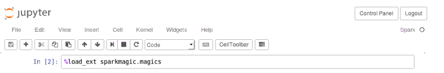
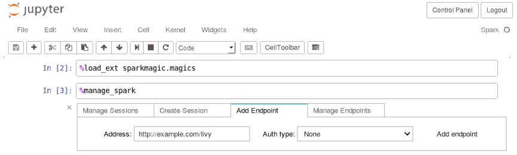

# Example Jupyter Notebooks

* [Overview](#overview)
* [Connecting](#connecting)
* [Quick start](#quick-start)
  * [Log into Jupyter Portal](#log-into-jupyter-portal)
  * [Upload example notebook](#upload-example-notebook)
  * [Open example notebook](#open-example-notebook)
  * [Spark Magic Usage](#spark-magic-usage)

## Overview

The [Jupyter Notebook](http://jupyter.org) is a web application that allows you to create and share documents that contain live code, equations, visualizations and explanatory text. In PNDA, it supports exploration and presentation of data from HDFS and HBase.

## Connecting

Along with PNDA cluster provisioning, Jupyter is deployed with four kernel supports: Python2 kernel, Python3 kernel, PySpark (Python2) kernel and Spark (Scala) kernel. An example Jupyter notebook is also provided with details instructions on how to rapid prototype using Jupyter PySpark kernel. In particular the example noteobook gives an example usage of platform libraries to load HDFS data and perform interactive data analytics. A sample Jupyter notebook is also provided for executing scala code using Spark kernel that allow to connect with remote Spark cluster and execute code.

By default, Jupyter is installed on `Jupyter` node. In order to access Jupyter portal go to: http://[cluster-name]-cdh-jupyter:8000

## Quick start

### Log into Jupyter portal

You should see a jupyter login page as below.

   

Use pnda/pnda to login, you will be redirected to a notebook list view. By default the list is empty.

   

### Upload example notebook

Clone example-jupyter-notebooks repository. Click the upload button and select the example notebook (`example-jupyter-notebooks/notebooks/Example Platform-library PySpark Notebook.ipynb`) from your local repository.

   

### Open example notebook

Click the link `Example Platform-library PySpark Notebook.ipynb`.

   

### Spark Magic Usage

The Spark kernel provides some predefined magics, which are special commands that you can call with %% i.e %%MAGICNAME.  Load 'sparkmagic' in order to interact with Spark from jupyter notebook.

   

The %manage_spark line magic will let you manage Livy endpoints and Spark sessions. You can provide Livy endpoint using DNS name/IP address of Jupyter node on which Livy server is running. By default Livy server is configured on port 8998. Add new endpoint using livy url and port number eg : http://[jupyter-node-ip/jupyter-node-dns]:8998. Authentication is not enabled for livy hence select 'None' as Auth type. You can create, delete and manage sessions for an endpoint from it.

   

