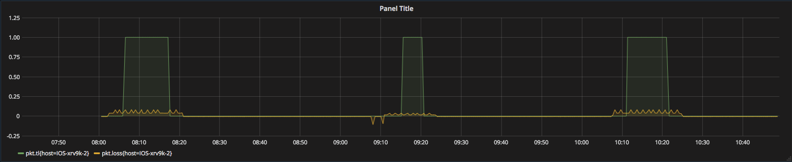

# Example Network Traffic-Loss Analysis Application

## Overview

The example batch application shows an example Python implementation of a simple mu-sigma-based detection algorithm to identify packet losses in XR telemetry data captured from a simple multiple host topology. Such packet losses are often indications of unintentional black-holing of traffics.

The application is a tar file containing binaries and configuration files required to perform batch processing. 

This example application saved analysis results (time-series data) into OpenTSDB, and make the results visualisable using Grafana dashbord. 

This application runs as a workflow, but see the spark-batch example for an example of an application that runs with coordinator on a schedule.

The application expects avro encoded telemetry data set as samples listed below:

 ```
 {'source': 'tla-src', 'rawdata': '{"timestamp": 1524751491231, "metric": "interface.packets-received", "value": 16280993, "tags": {"host": "IOS-xrv9k-2", "interface-name": "GigabitEthernet0/0/0/2"}}', 'host_ip': 'IOS-xrv9k-2', 'timestamp': 1524751491231}
 {'source': 'tla-src', 'rawdata': '{"timestamp": 1524751581351, "metric": "interface.packets-sent", "value": 17174445, "tags": {"host": "IOS-xrv9k-2", "interface-name": "GigabitEthernet0/0/0/2"}}', 'host_ip': 'IOS-xrv9k-2', 'timestamp': 1524751581351}
 ```
 
These are generated by the [sample data source](#run-sample-data-source)

## Requirements

* [Maven](https://maven.apache.org/docs/3.0.5/release-notes.html) 3.0.5
* [Java JDK](https://docs.oracle.com/javase/8/docs/technotes/guides/install/install_overview.html) 1.8

## Build

To build the example applications use:

````
mvn clean package
````

This command should be run at the root of the repository and will build the application package.  It will create a package file at app-package/target/tla-app-python-{version}.tar.gz.

## Spark Job

This version of the application requires Spark2 and Oozie Spark2 scheduler. 

## Files in the package

- `log4j.properties`: defines the log level and behaviour for the application.
- `properties.json`: contains default properties that may be overriden at application creation time.
- `workflow.xml`: Oozie workflow definition that run the spark2 job. See Oozie documenation for more information.
- `lib/job.py`: Python code that implements the data processing job.

## Deploying the package and creating an application

The PNDA console can be used to deploy the application package to a cluster and then to create an application instance. The console is available on port 80 on the edge node.

When creating an application in the console, ensure that the `input_data` property is set to a folder that contains data. If any data has been published to kafka, this will be found in HDFS under `/user/pnda/PNDA_datasets/datasets/tla-src` (after 30 minutes has passed and gobblin has run to import it).

**[NOTE: before starting the application, make sure to add `tsd.core.auto_create_metrics = true` to opentsdb configurations, which can be found at `/etc/opentsdb/opentsdb.conf` on the node opentsdb service runs.]**

```
input_data: /year=*
```

To make the package available for deployment it must be uploaded to a package repository. The default implementation is an OpenStack Swift container. The package may be uploaded via the PNDA repository manager which abstracts the container used, or by manually uploading the package to the container.


## Run sample data source

If you want to produce test data, there is a script in `data-source/src/main/resources/tla_src.py`. The scipt simulates a simple network topology with two routers in a core network. Network traffics traverse from edge router 1 to edge router 2 via the core network. Therefore there are only one-way traffics from core router 1 to core router 2. The script samples telemetry data very 30 seconds and collect accumulative packets sent/received on the single interface of each router. It also injects packets loss rate at 4% on core router 2. 


To run the data source script:

    cd data-source/src/main/resources
    python tla_src.py <kafka-broker-ip> <total-sampling-times>

e.g. to generate ten hour sample datasets run:
    
    python tla_src.py 127.0.0.1 1200

If running the script from edge node, creating a python virtual environment is recommended with those libraries specified in the requirement.txt file installed. 

## view the output in Grafana

Navigate to Grafana from your PNDA console main page (http://<your-ip\>:3000). Createa a new dashboard using `PDNA OpenTSDB` data source. All the reportable metrics starts with `pkt.` prefix. Add metrics to the newly created dashboard as the example below. 



